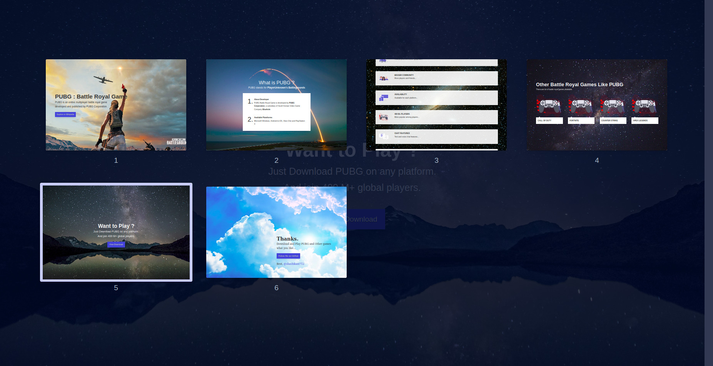

# WebSlide-Server

WebSlide-Server is just a beautiful presentation developed in HTML and NodeJS using Webslides. It is basically designed in HTML, CSS and JavaScript and NodeJS is just used to serve them to the browser.

###### [Demo](https://)

## What is Webslides ?

Webslides is the easiest way to make HTML presentations. It provides lots of features like Horizontal and Vertical Navigation, Slide Counter, Go to specific slide, Autoslide, 40 + components: background images/videos, quotes, cards, covers... and flexible blocks, fonts etc..

- [WebSlides Demo](https://webslides.tv/demo)
- [Download WebSlides](https://webslides.tv/webslides-latest.zip)

## Requirements

- NodeJS
- Webslides files

## Common Setup:

Clone the repo and install the dependecies.

`git clone https://github.com/shashikant712/WebSlide-Server.git`

`npm install`

To start the server, run the following command

`node index.js`

Open [https://127.0.0.1:5000](https://127.0.0.1:5000) and take a look around.

## Demo Images:

  

  

## Built With :

- [NodeJS](https://nodejs.org/en/)
- [WebSlides](https://github.com/webslides/webslides)
- [unDraw SVG Icons](https://undraw.co)
- [Unsplash Images](https://unsplash.com)

## Developed By :

- [Shashi Kant Yadav](https://github.com/shashikant712)

## License :

- [ISC License](https://choosealicense.com/licenses/isc/)
